# Лабораторная работа №2. Виртуальный Сервер
## Выполнено студетом: Britcov Egor, группа I2402
## Дата выполнения: *18.02.2026*

## Цель работы

Данная лабораторная работа знакомит с виртуализацией операционных систем (на примере ОС Debian) и настройкой виртуального HTTP сервера (LAMP).

## Ход работы

Для начала скачиваем дистрибутив `Debian` для серверов для архитектуры x64 (без графического интерфейса) и систему виртуализации (гипервизор) `QEMU`.

*`Debian` - операционная система на базе Linux.*

Скачал дистрибутив `Debian` и установил гипервизор `QEMU`.

*`QEMU` - гипервизор для запуска других OC и программ.

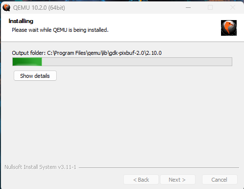

Установка прошла успешно, единственное что возникла проблема с тем, что QEMU не добавился в PATH.

Исправляем это добавляя QEMU в PATH и проверям установленную версию.

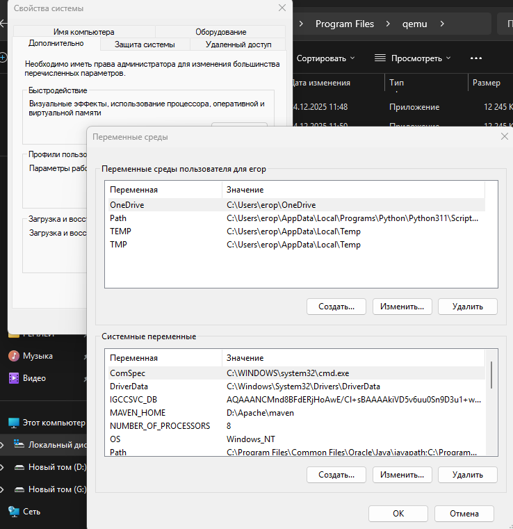


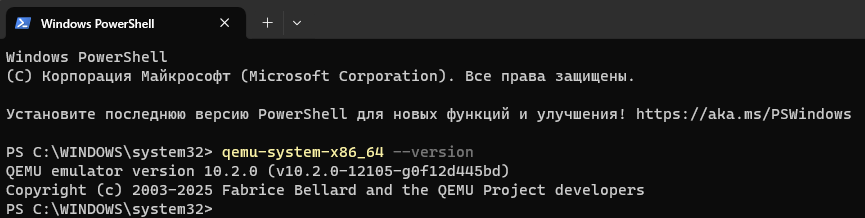

QWEMU успешно установлен!

Предварительно на GitHub был создан репозиторий *containers02* и склонирован локально через команду:

```
git clone <ssh-ссылка>
```

Локально были созданы :
- Папки:
    -  images (для скриншотов выполнения)
    - dvd (для хранния образа debain)
 

- Файлы:
    - readme.md (для оформления отчёта)
    - .gitignore (нужен для того, чтобы Git не добавлял в репозиторий лишние или тяжёлые файлы)

Получаем следующее:

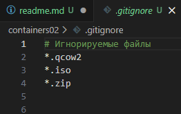

---

### Создание образа диска для виртуальной машины 

Размером 8 ГБ, формата qcow2, используя утилиту qemu-img:

Перемещаемся в местоположения нашей папки с проектом и выполняем следующую команду:

```
qemu-img create -f qcow2 debian.qcow2 8G
```
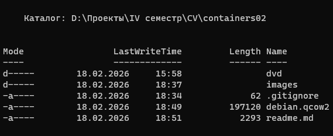

Видим всю структуру проекта и наличия файла `debian.qcow2`
это и есть наш образ диска

---

### Установка OC Debian на виртуальную машину.

Выполняем следующую команду для создания образа диска для виртуальной машины:
```
qcow2. qemu-img create -f qcow2 debian.qcow2 8G
```
Запускаю установку ОС с помощью команды и начинаю установку:
```
qemu-system-x86_64 -hda debian.qcow2 -cdrom dvd/debian.iso -boot d -m 2G
```

Далее запускается установщик Debian (простая серверная установка, без графики)

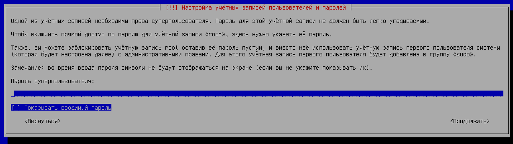

Настраиваем учетную запись пользователя и хост

- Имя компьютера: debian;
- Хостовое имя: debian.localhost;
- Имя пользователя: user;
- Пароль пользователя: password;
---
После успешной установки запускаем следующей командой:

```
qemu-system-x86_64 -hda debian.qcow2 -m 2G -smp 2 -device e1000,netdev=net0 -netdev user,id=net0,hostfwd=tcp::1080-:80,hostfwd=tcp::1022-:22
```
Входим в аккаунт и выполняем проверку:

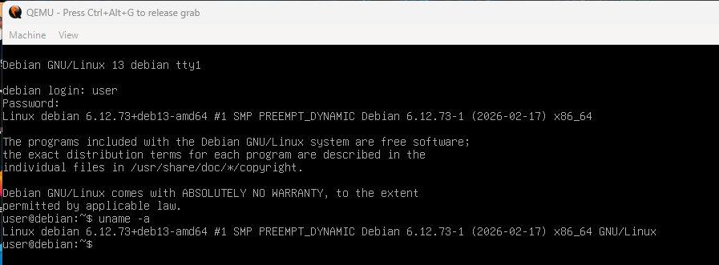

---

### Установка LAMP
*`LAMP` - Набор ПО для веб-сервера: Linux, Apache, MySQL/MariaDB, PHP.*

Для начала переключаемся на суперпользователя (root):
```
su
```

Затем обновляем список доступных пакетов и их версий из репозиториев:
```
app update -y
```
Устанавливаем:

```
apt install -y apache2 php libapache2-mod-php php-mysql mariadb-server mariadb-client unzip
```

- `apt install -y apache2` - 
устанавливает веб-сервер Apache чтобы можно было обрабатывать веб-страницы и отвечать на HTTP-запросы.
- `apt install -y php` - устанавливает интерпритатор PHP для обработки динамического контента на веб-странице.
- `apt install -y libapache2-mod-php` - модуль для Apache, который интегрирует PHP.
- `apt install -y php-mysql` - модуль PHP для работы с MySQL/MariaDB
- `apt install -y mariadb-server mariadb-client` - устанавливает сервер и клиент MariaDB:

    - mariadb-server — хранит и обрабатывает базы данных.

    - mariadb-client — позволяет подключаться к базам данных из терминала.
- `apt install -y unzip` - утилита для распаковки архивов формата ZIP.

---

### Установка СУБД PhpMyAdmin

*`PhpMyAdmin` - веб-интерфейс для управления базами данных MySQL/MariaDB.*

Запускаю установщик СУБД:
```
wget https://files.phpmyadmin.net/phpMyAdmin/5.2.2/phpMyAdmin-5.2.2-all-languages.zip
```
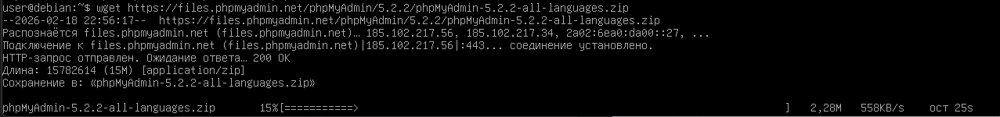

Запускаю установщик CMS WordPress:

*`WordPress` - система управления контентом (CMS)*

```
wget https://wordpress.org/latest.zip
```


Выполняем проверку файлов командой
```
ls -l
```
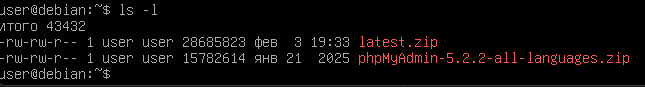

Все файлы успешно установлены!

---
Далее распаковываем скачанные файлы в папки :

 1. СУБД PhpMyAdmin ==>  /var/www/phpmyadmin;
 2. CMS WordPress ==> /var/www/wordpress;


Распаковываем оба файла:
```
unzip phpMyAdmin-5.2.2-all-languages.zip
unzip latest.zip
```

Дальше перемещаем их в папки `phpmyadmin` и `wordpress` соответсвенно:


Проверяем командой `ls`:

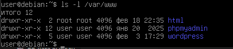

---

### Создание БД и пользователя для WordPress

При установке Debian я не указывал пароль для суперпользователя, поэтому чтобы получить доступ я прописываю:

```
sudo mysql
```

вместо

```
mysql -u root
```
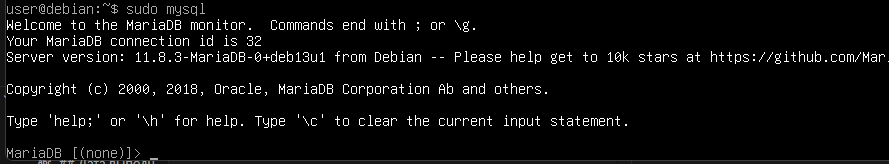

Далее создаю базу данных `wordpress_db`, в ней создаю пользователя и даю ему все привелегии.

```sql
CREATE DATABASE wordpress_db;
CREATE USER 'user'@'localhost' IDENTIFIED BY 'password';
GRANT ALL PRIVILEGES ON wordpress_db.* TO 'user'@'localhost';
FLUSH PRIVILEGES;
EXIT;
```
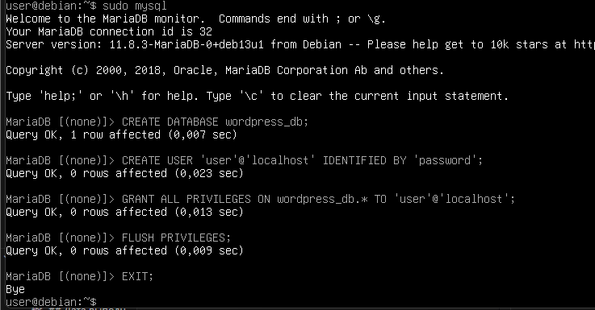
Проверяем создана ли база

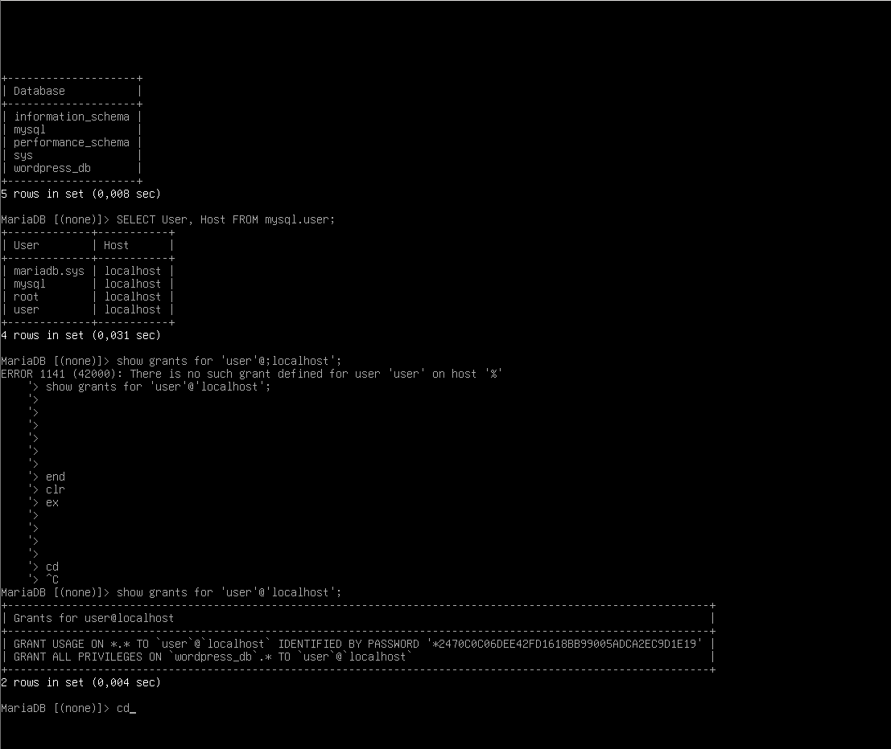

Видим что база `wordpress_db` успешна добавлена в список баз

А также добавлен пользователь со всеми правами доступа

---

Далее нам необходимо создать два файла:
- 01-phpmyadmin.conf
- 02-wordpress.conf

в папке `/etc/apache2/sites-available`

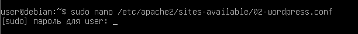

через команды:
```
nano /etc/apache2/sites-available/01-phpmyadmin.conf
nano /etc/apache2/sites-available/02-wordpress.conf
```

Файлы должны содержать следюущее:

для `01-phpmyadmin.conf`

```
<VirtualHost *:80>
    ServerAdmin webmaster@localhost
    DocumentRoot "/var/www/phpmyadmin"
    ServerName phpmyadmin.localhost
    ServerAlias www.phpmyadmin.localhost
    ErrorLog "/var/log/apache2/phpmyadmin.localhost-error.log"
    CustomLog "/var/log/apache2/phpmyadmin.localhost-access.log" common
</VirtualHost>
```


и для `01-wordpress.conf` соответсвенно.

```
<VirtualHost *:80>
    ServerAdmin webmaster@localhost
    DocumentRoot "/var/www/wordpress"
    ServerName wordpress.localhost
    ServerAlias www.wordpress.localhost
    ErrorLog "/var/log/apache2/wordpress.localhost-error.log"
    CustomLog "/var/log/apache2/wordpress.localhost-access.log" common
</VirtualHost>
```
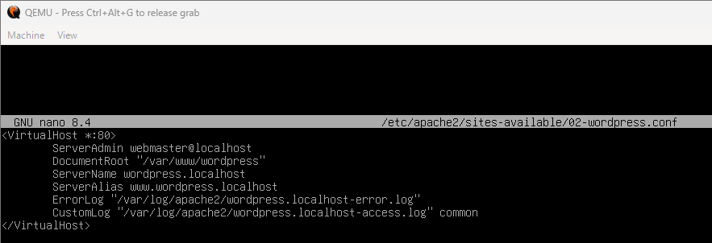


Далее необходимо настроить конфигурации выполнив следующие команды:

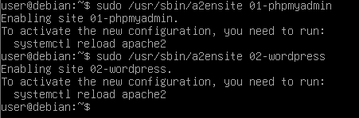

Добавляем в файл `/etc/hosts` строки:

```
127.0.0.1 phpmyadmin.localhost
127.0.0.1 wordpress.localhost
```
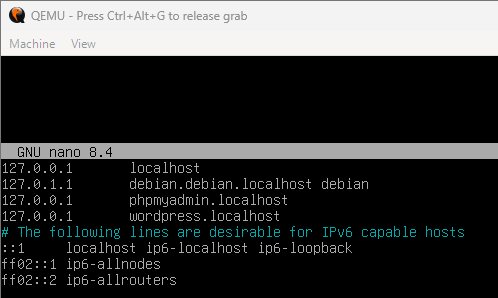

---

### Запуск и тестирование

После проделанных операций в консольном окне выполняем команду `uname -a`

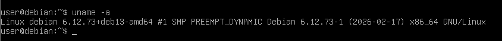

После выполнения данной команды мы видим следующее:
- Название системы (linux)
- Имя хоста
- Версию ядра
- Дату сборки
- Архитектуру

После этого перезагружаем Apache Web Server

*Перезагрузить Apache Web Server можно следующими командами*

```
sudo systemctl restart apache2
sudo systemctl reload apache2
```
Обе считаются правильными.

Я использовал `restart` и проверил через `sudo systemctl status apache2`

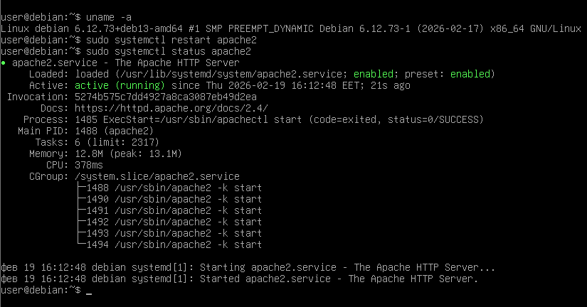

---

Осталось проверить доступность сайтов в браузере и завершить их устанвку.

Вводим сначала 

`http://wordpress.localhost:1080`
И видим окно настройки WordPress где завершаем настройку вводя данные пользователя, пароль и хост.

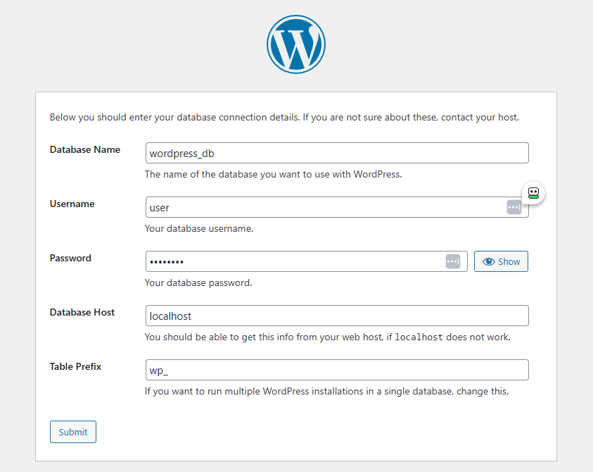

После чего всплывает следюущее окно оповещающее о завершении установки:

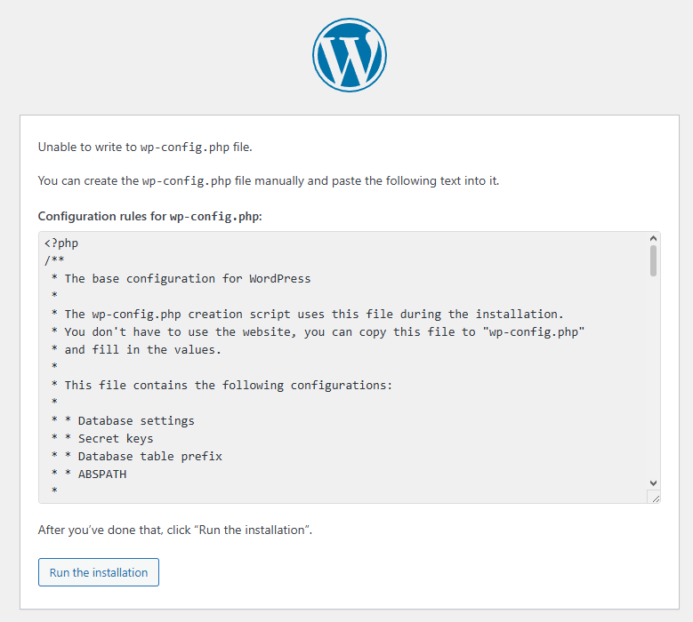

Такие же действия проводим для 

`http://phpmyadmin.localhost:1080`

Вводим эту ссылку в браузере

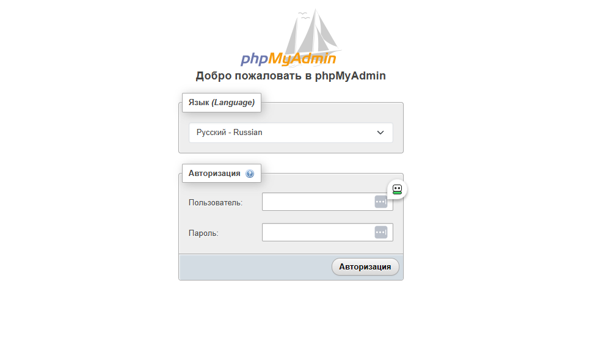

Вводим данные и видим следующее

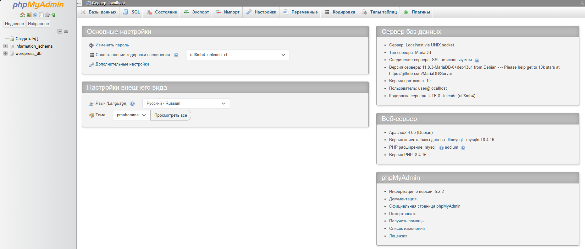

Все настроенно коректно. Установка завершена!

---

### Контрольные вопросы

1. Каким образом можно скачать файл при помощи wget?

Командой wget <ссылка_на_файл>. Файл будет скачан в текущую директорию.

2. Зачем создавать для каждого сайта свою БД и пользователя?

Это повышает безопасность и изоляцию данных: при взломе одного сайта остальные базы не пострадают.

3. Как поменять доступ к системе управления БД на порт 1234?

Нужно изменить порт в конфигурации Apache (VirtualHost <*:1234>) или в настройках MariaDB (параметр port), затем перезапустить сервер.

4. Какие преимущества даёт виртуализация?

Позволяет запускать несколько серверов на одной машине, изолировать среды и безопасно тестировать системы без риска для основной ОС.

5. Для чего устанавливать временную зону на сервере?

Для корректной работы логов, расписаний (cron) и серверных приложений, зависящих от времени.

6. Сколько места занимает установленная ОС?

Серверная версия Debian обычно занимает около 2–3 ГБ, но виртуальный диск может быть создан с запасом (например, 8 ГБ).

7. Рекомендации по разбиению диска для серверов? Почему так?  

Рекомендуется выделять отдельные разделы для /, /home, /var и swap, чтобы изолировать данные и логи; это повышает стабильность и упрощает администрирование.

---

### Заключение

В ходе выполнения лабораторной работы был создан виртуальный сервер на базе Debain с использованием гипервизора QEMU.

Также был установлен и настроен LAMP (Apache, MariaDB, PHP), развернуты WordPress и phpMyAdmin созданы виртуальные хосты и база данных, после чего была проверена корректная работа сайтов через браузер.

---

### Использованные источники

1. https://www.debian.org/doc/manuals/debian-reference/ch01.en.html#_the_shell_prompt

2. https://elearning.usm.md/mod/lesson/view.php?id=281349

3. https://elearning.usm.md/mod/page/view.php?id=298554
